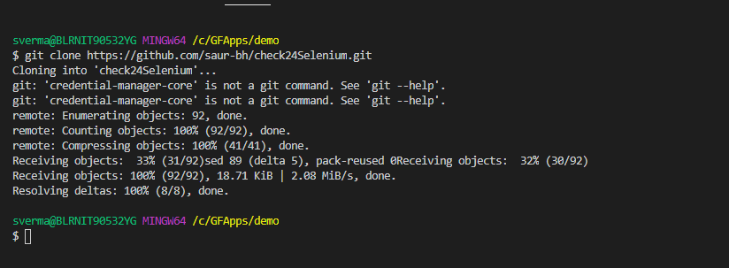
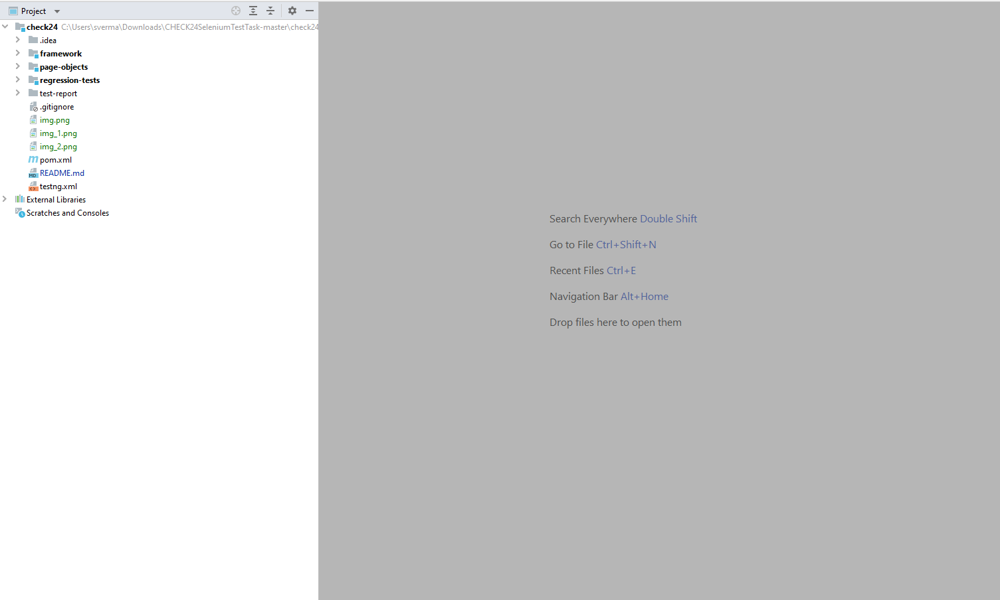
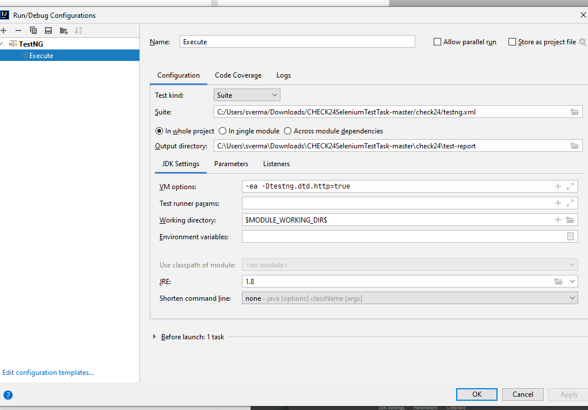
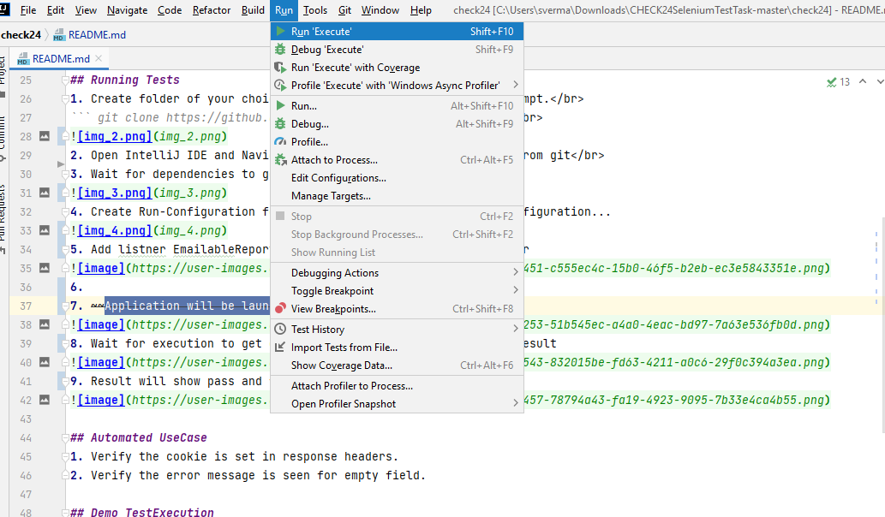
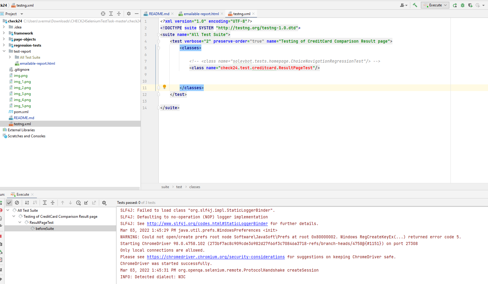
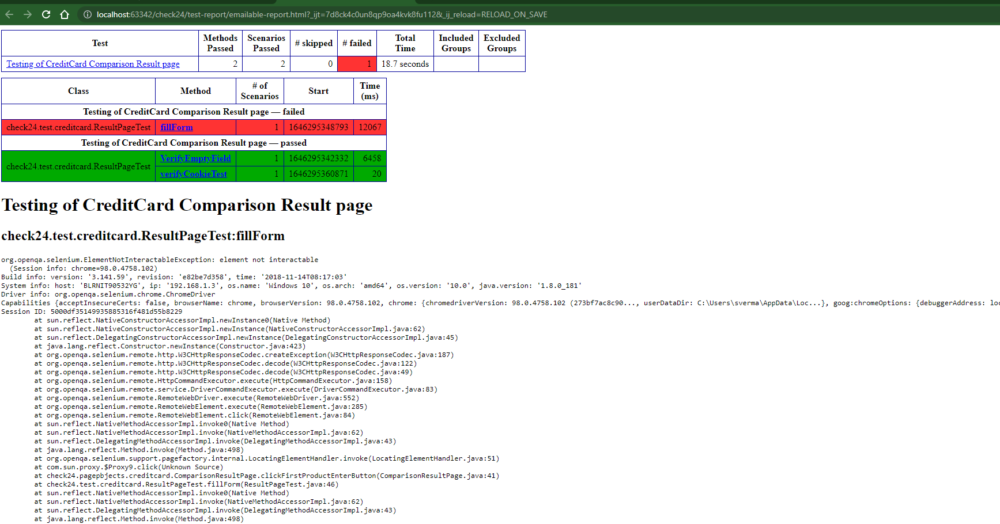

## check24 Automation Runbook
This Test Automation Framework is made while considering following points:
1. Abstraction
2. Maintainable and extendable
3. Simple and Ease-of-use
4. Retry or self healing on failure
5. Loggin and Reporting

## TechStack
* Java Programming language (1.8)
* WebDriver Web-Browser Automation tool
* TestNG Assertion framework
* Maven Build tool
* IntelliJ IDE
* github Source code management tool

## Setup
1. Install Java 1.8 if not present via following link https://www.oracle.com/java/technologies/javase/javase-jdk8-downloads.html
2. Install IntelliJ (https://www.jetbrains.com/idea/download/) package as per your operating system
3. Set Path variable for the the Java (https://www.javatpoint.com/how-to-set-path-in-java)

## Architechure


## Running Tests
1. Create folder of your choice and navigate to it via command prompt.</br>
``` git clone https://github.com/saur-bh/check24Selenium.git``` </br>

2. Open IntelliJ IDE and Navigate to the folder which was cloned from git</br>
3. Wait for dependencies to get download</br>

4. Create Run-Configuration for testNG by clicking on Run>Edit Configuration...

5. Add listner EmailableReporter, FailReporter and testHTMLReporter

6. Click on Run and Run 'Execute'

7. Wait for execution to get over and then open HTML file to see result

8. Result will show pass and failure

## Automated UseCase
1. Verify the cookie is set in response headers.
2. Verify the error message is seen for empty field.


## Creation of New Test 
 You should have these Maven modules:
 * framework - core classes that form the framework
 * page-objects - components and locators of each webpage
 * regression-tests - actual test classes that rely on page objects
 
 Our framework is based on the Page Object Model design pattern. We will also be using the WebDriver’s PageFactory class to initialize WebElements.


1. Create new package  i.e. check24.tests.<packageName> and then class Demo which extends BaseTest</br>
```
package check24.test.Demo;

import check24.framework.core.BaseTest;
import check24.pagepbjects.creditcard.ComparisonResultPage;
import check24.pagepbjects.creditcard.GeneralPage;
import check24.pagepbjects.creditcard.PersonalInfoPage;
import org.testng.annotations.BeforeTest;
import org.testng.annotations.Test;

public class Demo extends BaseTest {

    ComparisonResultPage comparisonResultPage;
    GeneralPage generalPage;
    PersonalInfoPage personalInfoPage;


    @BeforeTest                                             // annotated method placed in the beginning.
    public void before_test() {

        comparisonResultPage = new ComparisonResultPage(getDriver());
        generalPage = new GeneralPage(getDriver());
        personalInfoPage = new PersonalInfoPage(getDriver());
        System.out.println("Setting up the object ");
    }

    @Test(priority = 0)
    public void verifyCookieTest() {

        comparisonResultPage.verifyCookieName();

    }

    @Test
    public void VerifyEmptyField(){
        comparisonResultPage.clickFirstProductEnterButton();
        generalPage.enterEmailAddressAndClickEnter("Saurabh@Test.com");
        generalPage.selectRadioBtn();
        personalInfoPage.clickFormBtn();
        personalInfoPage.verifyErrorMessage("anrede","Bitte wählen Sie Ihre Anrede aus.");
        personalInfoPage.verifyErrorMessage("vorname","Bitte geben Sie Ihren Vornamen an.");

    }
  
   ```
    
2. Create new method using @Test (testng annotation) 
```
    @Test(dependsOnMethods = {"homepageTests"})
    public void demoToCreateTestCase() {
        String msg = "Your feedback was sent successfully.";
        feedback.clickNavBtn("New");
        feedback.clickChoiceBasedonText("Learn about Customer Service Automation");
        feedback.clickChoiceBasedonText("Beginners Guide to Chatbots ebook");
        feedback.clickThumbsUp();
        feedback.clickChoiceBasedonText("Rate your conversation");
        feedback.selectFeedback(2);
        feedback.clickSendFeedbackButton();
        feedback.verifySuccessMessage(msg);
        feedback.clickBackbtn();

    }
```
3. Save the file and then right click on it to Run
 
4. Adding the Page Objects ( If new Page has to be created)
    In the check24-page-objects module, create new package i.e. check24.pageobjects.demo and then class Demo which extends BasePage</br>
```
    package check24.pageobjects.demo;
    import org.openqa.selenium.WebDriver;
   import check24.framework.core.BasePage;

    public class Demo extends BasePage {
    public Demo(WebDriver driver) {
        super(driver);
    }
   } 
```


## Enhancement
  * Integration with CI tool i.e. Jenkins.
  * Email reporting on the status of execution.
  * Integration with other automation i.e. API.
  * Setup and TearDown of testData

